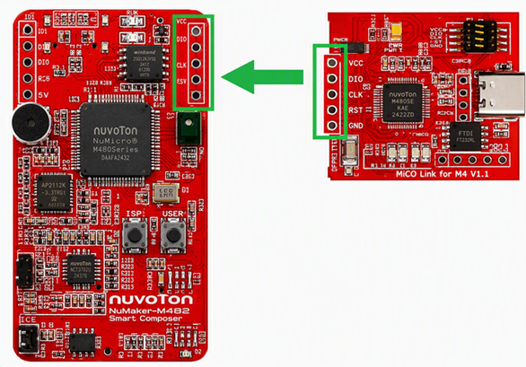
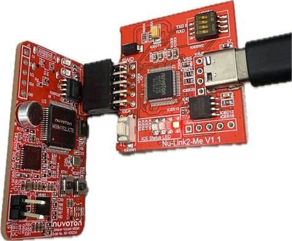
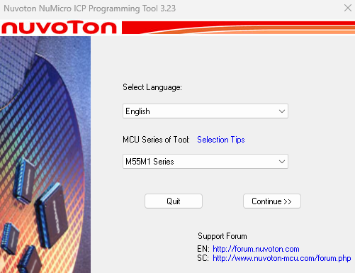
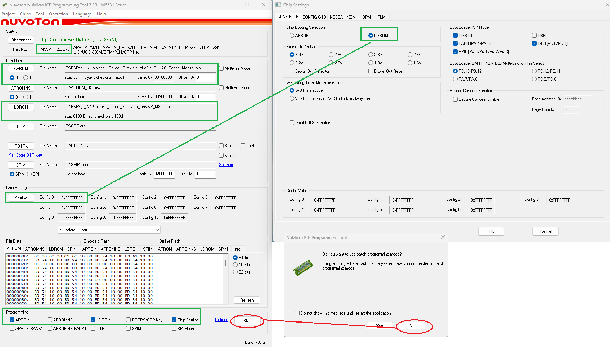
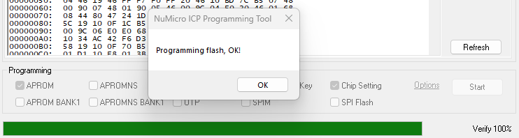
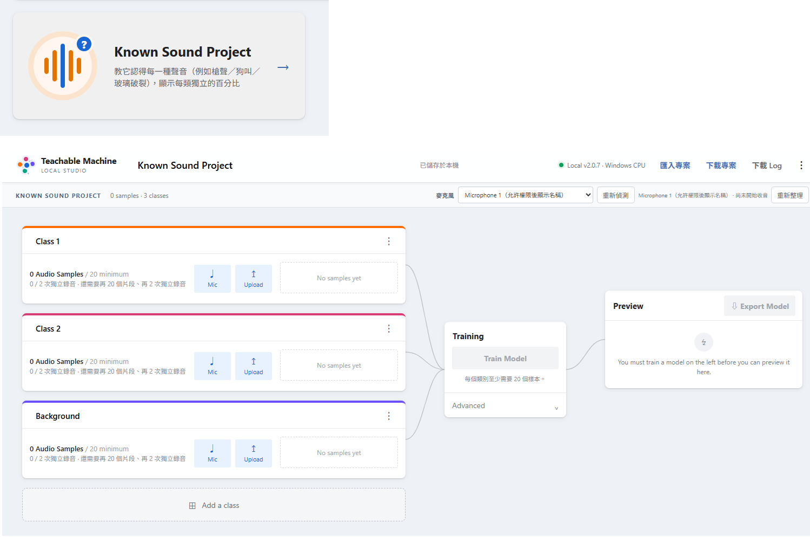

# NuMaker-VoiceAI / TeachableMachine_Local_Studio_v3 — Git 安裝步驟

本文件說明如何建立 Python 開發環境、燒錄 Firmware，以及啟動 Local Teachable Machine Studio 的完整流程。

## Step 1. 建立 Python 環境

安裝 **Python v3.13.15**（請直接使用提供版本，避免版本差異造成異常）。 （0_Python_3.13.15）

## Step 2. 建立 Download Firmware 環境

1. 安裝 [NuMicro ICP programming tool](https://www.nuvoton.com/resource-download.jsp?tp_GUID=SW1720200221181328&currentFolder=/products/microcontrollers/arm-cortex-m23-mcus/m2l31-series/&t=1788155572)。

   連接NuLink2me與NK-VoiceAI
   
   
   
   
   
   
3. 開啟 ICP programmer，選擇 **M55M1** 系列：
   

4. 燒錄檔案設定：
   - **APROM** 內載入 `/1_Collect Firmware_bin/DMIC_UAC_Codec_Monitor.bin`  （1_Collect_Firmware_bin）
   - **LDROM** 內載入 `/1_Collect Firmware_bin/ISP_MSC 2.bin`  （1_Collect_Firmware_bin）
   - **Setting** 配置 `boot from LDROM`
   

5. 配置完成後，點選 **Start → batch programming mode (No)** 正確完成燒錄，確認進度100%並出現燒錄完成提示
   

   關閉ICP連接，移除NuLink, USB直接連接 NK-VoiceAI。

## Step 3. 建立 Local Teachable Machine 環境

> ⚠️ 安裝過程中請避免防火牆造成安裝失敗。

- `01_INSTALL.bat`：會自動安裝好環境（Python 虛擬環境 `.venv`、相依套件等）。（2_PC Model Training）
- `02_START.bat`：啟動後可以進行模型訓練 (Train Model)。（2_PC Model Training）

---

## 修訂紀錄 (Revision History)

| 日期 | 版本 | 說明 |
|------|------|------|
| 2026.09.04 | 1.0 | Initial Release. |
